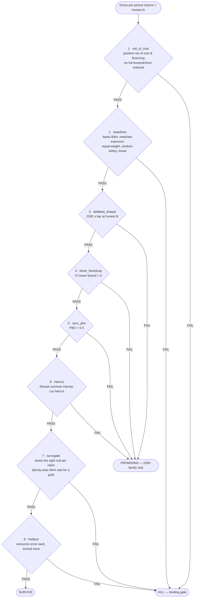

# Methodology — The Gauntlet: A Binding-Order Anti-Overfitting Gate Chain

> **This is the durable asset of the project.** Across **~111 distinct crypto trading
> hypotheses** — ~35 in prior rounds plus **58** in the 2026-06 parallelized domain campaign
> plus an **18-hypothesis $0 backlog** — tested on real public data at full rigor (cloud
> spend **$0**), the gauntlet returned **0 clean SURVIVE**. The two best leads sit at the
> **PROMISING** boundary, weak and caveated; everything else is a **KILL**. The thing that
> generalizes — and the thing worth sharing — is **the methodology**: an *ordered* chain of
> committed statistical and economic gates, the **right surrogate null per claim**, an
> **honest trial count `N`**, financing charged on the **full levered/short notional**, and a
> **consume-once holdout**. This page documents that methodology so a stranger can evaluate
> it, reuse it, or attack it.
>
> **A KILL is a valid, valuable outcome.** Negative results plus a methodology that does not
> lie are a rare and useful contribution in quantitative finance. We do not oversell, and we
> deploy no capital.
>
> **License:** MIT (see [`../LICENSE`](../LICENSE)).
> **Companion docs:** [`EDGE_SEARCH_DOMAIN_CAMPAIGN.md`](./EDGE_SEARCH_DOMAIN_CAMPAIGN.md)
> (the 2026-06 campaign roll-up + KILL ledger + the two surviving audits),
> [`BACKLOG.md`](./BACKLOG.md) (the testable-hypothesis backlog).
> Committed gate primitives:
> [`src/lib/statistical-validation.ts`](../src/lib/statistical-validation.ts) (re-exported
> by the `src/lib/training/statistical-validation.ts` shim that the campaign scripts import),
> chained by per-domain `runGauntlet` wrappers (e.g.
> [`scripts/edgehunt-D5/harness.ts`](../scripts/edgehunt-D5/harness.ts)). The repo also
> exposes a single-series [`validateStrategy()`](../src/lib/validation/strategy-validator.ts)
> wrapper and a searched-grid
> [`validateStrategyFamily()`](../src/lib/validation/strategy-family-validator.ts) wrapper;
> claim→code→test mappings are in
> [`METHODOLOGY_CONFORMANCE.md`](./METHODOLOGY_CONFORMANCE.md).

---

## 1. The problem: why an honest-looking backtest is usually a lie

A backtest is a measurement taken **after** you have already searched a space of strategies
and selected the best one. That selection step is the trap. Three named pathologies make a
"good" backtest almost worthless on its own:

- **Backtest overfitting.** If you try enough variations on a fixed history, one of them
  will look excellent **by chance**. The more configurations you try, the higher the best
  in-sample Sharpe you will find on data with *no real edge at all*. This is selection bias,
  not skill.
- **The multiple-testing problem.** A single `t > 2` (or `p < 0.05`) is only meaningful for
  **one** pre-registered test. If you ran hundreds, that bar is far too low: Harvey, Liu &
  Zhu (2016) argue the honest bar, given how many factors the literature has actually tried,
  is closer to `|t| > 3`. Reporting the unadjusted p-value of the *winner* is the central
  sin of strategy backtesting.
- **The False Strategy Theorem** (Bailey & López de Prado). Given `N` strategies with a
  **true** Sharpe of exactly zero, the *expected maximum* of their in-sample Sharpe ratios
  grows with `N`. So "my best of 200 configs has Sharpe 1.3" is not evidence of edge until
  you deflate it by how hard you looked. The associated **Minimum Backtest Length** bound
  says a backtest shorter than some length cannot distinguish real Sharpe from the
  luck-of-selection maximum — uninterpretable regardless of how pretty it is.

The consequence: **significance of the selected champion is necessary but not sufficient,
and it must be computed against the true search effort.** On top of that, even a genuinely
significant Sharpe can still be (a) un-tradeable after realistic cost *and financing*, (b)
just re-labeled market beta, or (c) an artifact of autocorrelation a dumb null reproduces. A
single gate cannot catch all of these. Hence a **chain** — run in a **fixed binding order**.

---

## 2. Design principles

1. **Gates, not knobs.** Each gate is a hard pass/fail. The first failing gate in the fixed
   order is the **binding gate** — the reason the target died. You never tune a gate to let
   a favorite through; you change the *target*. **Change the target, never the gates.**
2. **Cheap economic gates before expensive statistical ones.** A signal that is only
   positive *gross* of cost, or that loses to buy-and-hold / matched-exposure, should die
   immediately and cheaply — before we spend compute on Deflated Sharpe or surrogates.
3. **Net of realistic cost *and* financing, always.** Edge is measured after charging taker
   fees on every position change **and** charging borrow/financing on the **full levered or
   short notional** — not on one unit. A gross-only or finance-leaked signal is an automatic
   downgrade (see §5.4 — this leak silently inflated three leads in 2026-06).
4. **Honest `N` is mandatory, not optional.** The trial count must be the **true number of
   distinct configs you searched**, counted *before* the search, and it must never default
   to 1 or to the argmax.
5. **The right null per claim.** A surrogate is only a control if it destroys the *specific*
   structure the strategy claims to exploit while preserving everything else. The wrong null
   either over-kills or under-kills (§4, §5.2). For a *searched* family the null must be the
   **family-wise MAX-statistic**, not the single-best-config p (§5.3 — the decisive 2026-06
   lesson).
6. **Reuse committed, individually-tested gate code.** The per-domain `runGauntlet` wrappers
   *compose* the primitives in [`src/lib/training/`](../src/lib/training/); they do not
   reimplement them. The only new code is orchestration and the surrogate-null generators.
7. **Deterministic and auditable.** Pure functions, seeded randomness, no network or I/O in
   the gate path. The same inputs always produce the same verdict, and every number traces
   to a committed machine-readable artifact under `output/`.

---

## 3. The gauntlet (binding order)

The gates run in **one fixed order**. Each targets a *different* failure mode. The
**binding gate is whichever fails first**; a target can be doomed by several at once, but
the binding gate is the first wall it hit. The full per-gate record is always retained.

```
net_of_cost → baselines → deflated_sharpe → block_bootstrap → cpcv_pbo → haircut → surrogate → holdout
```

(Exact order in [`scripts/edgehunt-D5/harness.ts`](../scripts/edgehunt-D5/harness.ts) →
`runGauntlet`.)

The same chain as a flow — each gate is a hard pass/fail; the **first FAIL is the binding
gate** and the target dies there, while a PASS flows to the next gate. Clearing all eight (with
baselines supplied) is the only path to **SURVIVE**; tripping *only* a multiple-testing /
DSR-family gate (3–6) after the core economic gates pass is **PROMISING**:



| # | Gate (`id`) | What it certifies | Academic anchor | Primitive reused |
|---|---|---|---|---|
| 1 | `net_of_cost` | Positive **net of taker cost** (every position change) **and of financing on the full levered/short notional**; turnover reported. Gross-only / finance-leaked ⇒ downgrade. | cost realism; limits-to-arbitrage | `summarizeReturnSeries` |
| 2 | `baselines` | Beats **buy-and-hold** AND a **matched-exposure** benchmark (for timing) / is **beta-neutral** with alpha-t on the residual (for cross-sectional), plus equal-weight + random-lottery + one-layer-linear, all net. | Chen & Navet 2007; Zeng et al. 2023 | baseline builders |
| 3 | `deflated_sharpe` | Deflated Sharpe probability ≥ bar **at an explicit honest `N`** (= every config searched). | Bailey & López de Prado 2014; MinBTL | `computeDeflatedSharpeRatio` |
| 4 | `block_bootstrap` | Block-bootstrap confidence interval on the **scoring statistic** (the same one as gate 1 — default `compoundReturn`) **excludes zero** (lower bound `> 0`, dependence-aware). | Politis & Romano 1994 | `blockBootstrapConfidenceInterval` |
| 5 | `cpcv_pbo` | Probability of Backtest Overfitting `< 0.5` over combinatorial splits; `<8` folds flagged degenerate. | Bailey, Borwein, López de Prado & Zhu 2017 | `estimateCscvPbo` |
| 6 | `haircut` | Sharpe survives the **multiple-testing haircut** (Bonferroni / Holm / BHY). Often the *true* binding gate. | Harvey & Liu 2015 | haircut routine |
| 7 | `surrogate` | Real edge beats the **right null per claim** — including the **family-wise MAX-statistic** for a searched grid. *The hero.* | Theiler 1992; Lo-MacKinlay 1990; et al. | null generators |
| 8 | `holdout` | A most-recent block the search **never touched**, scored **exactly once**. | López de Prado 2018 | holdout guard |

**Verdict scheme.** `validateStrategy()` emits a legacy binary `verdict: PASS|KILL` (driven
by the first gate whose `passed` flag is false) *and* a richer
`scientificVerdict: SURVIVE | PROMISING | KILL | DEFERRED | INDETERMINATE`:

- **SURVIVE** — *every* gate passes (`bindingGate = none`) **and** baselines were supplied
  and passed.
- **PROMISING** — passes the **core** economic gates (`net_of_cost`, `baselines`,
  `surrogate`, `holdout`) but trips a **multiple-testing / DSR-family** gate (`deflated_sharpe`,
  `block_bootstrap`, `cpcv_pbo`, or `haircut`). The *structure/sign* is real; the *realized
  mean is not significant at honest `N` on unseen data*. This is exactly the PROMISING/SURVIVE
  boundary (§5.3).
- **KILL** — fails a core economic gate (most cost, baseline, surrogate, or holdout
  failures).
- **INDETERMINATE** — no baselines were supplied, so an edge cannot be certified (and nothing
  else already KILLed it). `strictBaselines: true` makes a missing baselines set a hard FAIL;
  the default leaves it ADVISORY (non-binding) but caps the verdict below SURVIVE.
- **DEFERRED** — not run because the only honest test needs data we do not have at $0
  (e.g. point-in-time L2 order books, paid PIT options chains). Not a verdict on edge — a
  verdict on *coverage*; applied by a human reading the gate evidence.

Each gate additionally carries a **`status: PASS | FAIL | SKIP | ADVISORY`** alongside the
legacy `passed` boolean. `SKIP` (e.g. `cpcv_pbo` with no genuine strategies×folds matrix, or
an empty holdout vault) and `ADVISORY` (e.g. `baselines` with none supplied in non-strict
mode) both carry `passed:true` and are therefore **non-binding** — they are never a confident
PASS.

### Gate 1 — Net of cost *and financing*

Taker cost is charged on **every position change**: `|Δposition| × roundTrip`,
`roundTrip = 2 × takerPerSide` (default 4 bps/side, 8 bps round-trip). **Financing/borrow is
charged on the full levered or short notional, not on one unit.** This is the cheapest
filter and it kills a surprising amount — and the financing leg is the one most often
forgotten. The systemic 2026-06 financing leak (§5.4) lived here. The leverage-aware charge
is committed in
[`src/lib/cost/execution-cost-model.ts`](../src/lib/cost/execution-cost-model.ts)
(`chargeExecutionCosts` sizes borrow, perp funding, futures financing, and the risk-free leg
to the **full levered/short notional**); `validateStrategy()` routes the `net_of_cost` gate
through it when you pass the optional `costModel` option.

### Gate 2 — Baselines (the first *economic* test)

Significance is not *economic edge*. A target must beat the dumb thing you could have done:

- **Buy-and-hold** — most "trend"/"TA" edges in a bull market are just filtered long beta.
- **Matched-exposure benchmark (for any timing/overlay).** A low-exposure long/flat overlay
  *structurally cannot* out-Sharpe 100%-long buy-and-hold, so scoring it only against B&H is
  an **artifact**. The honest bar is the incremental lift over a benchmark holding the *same
  average exposure*.
- **Beta-neutrality (for any cross-sectional book).** Require book β ≈ 0 and report the
  **alpha-t on the residual**, using an **honest out-of-sample hedge beta** — never an
  in-sample over-hedge (which manufactures fake alpha).
- **Equal-weight** panel return, **random-lottery trader** (Chen & Navet 2007), and a
  **one-layer linear** baseline (Zeng et al. 2023): any complex model must beat the trivial
  linear one.

### Gates 3–6 — The multiple-testing / overfitting block

Deflated Sharpe at honest `N` (§5.1); a dependence-aware block-bootstrap CI on the mean;
CPCV/PBO over combinatorial splits (PBO ≥ 0.5 ⇒ selection is a coin-flip OOS); and the
Harvey-Liu haircut, which adjusts the champion's p-value for multiple testing and backs out
the Sharpe consistent with the adjusted p. **The haircut is frequently the real binding
gate** — e.g. a 52-week-high breakout that binds on the haircut going to 0 even at a lenient
`N = 6`, not on the DSR it was cited against.

### Gate 7 — Surrogate / placebo (the hero)

See §4 and §5.2–§5.3. This is the project's sharpest tool and the one that did the decisive
killing — twice over: it must be the **right null per claim**, and for a searched grid it
must be the **family-wise MAX-statistic**.

### Gate 8 — Consume-once holdout

A final, most-recent block of history the search **never touches**, scored **exactly once**.
A second scoring attempt is barred — re-tuning against the vault would void the verdict.
See §5.5.

---

## 4. The right null per claim (non-negotiable)

A surrogate answers one question: *"Is the machine tracking something real, or is it just
good at manufacturing a pretty backtest out of any series with the same superficial shape?"*
You answer it by building **placebo datasets** that keep the boring real properties
(volatility, autocorrelation) but **destroy the specific structure the strategy claims to
exploit**, then run the *exact same* search and scoring on them. If the placebos do as well
as the real data — where, by construction, no real edge exists — the "edge" is an
optimization artifact. It is the placebo arm of a drug trial.

**The null must match the claim.** Using the wrong null either over-kills (a directional
carry "fails" a cross-sectional shuffle that has no power over it) or under-kills (a
per-cell calendar placebo passes a data-mined grid). The mapping the campaign committed:

| Claim type | Right null | Destroys | Preserves |
|---|---|---|---|
| **Time-series timing** | **phase-randomization** / **block bootstrap** | nonlinear/regime/long-range structure | variance, linear autocorrelation |
| **Rotation / relative-value / lead-lag** | **cross-sectional shuffle** | genuine cross-asset rotation | each asset's marginal distribution exactly |
| **Path-dependent exits** (stops/brackets) | **bracket-on-surrogate** | claimed path-timing edge | the bracket logic + marginal dynamics |
| **Volatility-clustering** strategies | **GARCH-simulated** zero-edge | any edge beyond vol clustering | the conditional-vol process |
| **Variance risk premium** | **shuffled-VRP placebo** | the sizing/timing *skill* | the realized premium itself |
| **Calendar / event** | **calendar-reanchor + family-wise MAX-stat** | the chosen anchor's special status | event count, seasonality shape |
| **Macro / sentiment** | **AR-matched placebo** (same persistence) | the predictor's information | the autocorrelation/persistence |

> **Searched grid ⇒ family-wise.** Whenever the config was *selected* from a grid, the
> surrogate must take the **MAX statistic over the whole grid per surrogate draw** (one
> shared, coherent permutation realization applied to every config, then grid-MAX). The
> single-best-config p is **not** a valid null for a searched family — it is the exact
> data-mining trap the surrogate is supposed to catch (§5.3).

> **Caveat — the too-powerful vol/spectrum-preserving surrogate.** For a long/flat
> price-transform overlay on a secularly rising asset (Supertrend, CCI, etc.), a
> vol/spectrum-preserving surrogate can *inflate* the shared long-beta and score **above**
> the live strategy (CCI surrogate mean ≈ 2.3–2.4 > 1.768 live, p ≈ 1.0; Supertrend/CCI
> surrogates scored +0.75–1.09 of inflated long-beta above their own passive long). Do not
> read that as "the strategy is worse than noise." Judge such overlays on the **long-beta-
> *differenced* lift** — the incremental Sharpe over their own buy-and-hold — not on the raw
> surrogate comparison.

---

## 5. The load-bearing parts (with the concrete kills)

### 5.1 Honest trial count `N`

The Deflated Sharpe and the haircut **only deflate if you feed them the true number of
distinct configs you searched** — counted **before** the search, never the argmax. Feeding
`N = 1`, or a per-family bucket, silently skips the deflation and lets a data-mined champion
sail through. **The only honest way to collapse `N → 1` is genuine pre-registration:** a
single, mechanism-justified config **frozen before any neighborhood search**. If the
"pre-registered" config is actually the rank-1 point of a searched neighborhood, then honest
`N` = the neighborhood size, not 1 — and both the DSR economics *and* the surrogate gate
(§5.3) must be recomputed at that `N`. This single substitution flipped the strongest 2026-06
lead from PROMISING to KILL.

### 5.2 The surrogate, applied correctly — examples

- **GA over trading rules: placebo p ≈ 1.000.** A genetic program run on *pure
  phase-randomized / block-bootstrap noise* found champions *better* out-of-sample than the
  real champion — every noise run did at least as well. The GA is the ultimate overfitter;
  without the surrogate this would have read as an in-sample win.
- **Rotation: the cross-sectional shuffle was decisive.** A "ride the relay" rotation
  strategy's entire lead-lag statistic was reproduced by permuting which asset gets which
  path — the "capital rotation across tiers" was really single-asset momentum plus an
  aggregate vol state. Only the cross-sectional shuffle told the two apart.
- **The whole free-tier order-flow domain dies at h ≥ 1** via the **h=0 leakage gate**
  (§5.6): the apparent Sharpe lives entirely in the contemporaneous bar.

### 5.3 The family-wise MAX-statistic — the decisive 2026-06 lesson (flipped 3 leads)

The sharpest single result of the campaign. **A surrogate run on only the single
in-sample-selected grid-best config — with no family-wise correction — is itself a
multiple-testing artifact.** It answers "is *this one* config better than noise?" when the
honest question is "is the **best of the grid I searched** better than the **best a search of
the same grid finds on noise**?" The correct null is the **family-wise MAX-statistic**: per
surrogate draw, rebuild *every* config and take the grid-MAX; compare the real grid-best to
that distribution.

Three earlier PROMISING leads were flipped to **KILL** on exactly this defect (two-layer
independent audit — `output/edgehunt-audit/SUMMARY.md`,
`output/edgehunt-audit-nb/SUMMARY.md`):

| Lead | Single-config harness p | Family-wise MAX-stat p (searched grid) | Honest-N DSR at full grid | Verdict |
|---|---:|---:|---:|---|
| **BTC exchange reserve-depletion** (netflow) | 0.013 | **≈ 0.24** (real best 0.994 < surr95 ≈ 1.19) | fails (config is argmax of a ~12-config neighborhood ⇒ `N ≠ 1`) | **KILL** |
| **Q9 cross-sectional low-vol anomaly** | 0.002 | **≈ 0.06** (borderline, seed-sensitive) | **0.476** @ N=96 (Harvey-Liu adjP 0.673) | **KILL** |
| **O3 fee-revenue NVT** (BTC) | 0.005 | **0.093** @ N=312 (real 1.332 < surr95-max 1.384) | **0.894** @ N=312 (the N=54 pass was a post-hoc carve-out) | **KILL** |

> **The meta-lesson.** A right-null surrogate **PASS proves the structure/sign is
> non-random — it does NOT prove the realized mean is positive-with-significance at honest
> `N` on unseen data.** That gap *is* the PROMISING/SURVIVE boundary, and in 2026-06 **no
> lead crossed it.** (For Q9 the family-wise surrogate is only a borderline secondary
> contributor — the robust kill is honest-N DSR 0.476 and the haircut 0.673; the audit even
> self-corrected an inflated independent-per-config null of 0.397 down to the coherent ≈0.06.
> The two-layer audit re-derived every disputed number from the committed primitives and
> found **no false-KILL anywhere**.)

### 5.4 Financing on the full levered/short notional (a systemic leak)

The 2026-06 audit found a **systemic** accounting leak: every short or levered book charged
the risk-free rate on **one unit** while charging borrow on **none of the levered/short
notional**. On a KILL this only deepens the kill; on the carries it **inflated the
headline**:

- **Dated-futures basis carry** — at the correct levered RF charge (average leverage
  ≈ 2.95×), Sharpe collapses **1.64 → 0.69**, ≈ **$1,062 → $447/mo @ $100k**, DSR
  **0.58 → 0.13** (and it fails the 0.95 gate at *any* RF ≥ 0.75%/yr). The "levered headline"
  was a financing-leak artifact. Only a **thin UNLEVERED** market-neutral excess survives —
  ≈ 4.9%/yr, t = 2.41 — which is **sub-every-multiple-testing-bar** and regime-fragile
  (sub-RF in 2023, −37% in the 2021 cohort).
- **XS Donchian L/S** — its 2×-gross dollar-neutral book holds ≈ 1.0× short notional daily
  with zero borrow charged; charging it erodes the consume-once holdout from **0.53 toward
  0 / negative**. Report the OOS Sharpe as a **range ≈ 0.3–0.5**, not a point 0.53.

### 5.5 Consume-once holdout

The search may see train and selection data, and may even audit a posterior `test` slice,
but a truly out-of-sample verdict needs a final, most-recent block the search **never
touches** and that is **scored exactly once**. A second attempt is barred. This is where the
prediction edges died, one after another — and where the surviving leads revealed their
weakness: the XS Donchian lead's structure is real (cross-sectional-shuffle p = 0.009,
positive at every `N ∈ [20, 200]` and every holdout quarter), but on the **388-row
consume-once holdout the magnitude is indistinguishable from zero** (DSR@N=1 = 0.79,
Newey-West t(mean) = 0.96, block-bootstrap CI-lower < 0).

> **Survivorship caveat.** The 30-coin panels are survivorship-biased (LUNA / FTT / UST
> absent), so **even the holdout is an upper bound** — a −90% delisting shock flips the XS
> Donchian holdout negative in ~17% of draws. A survivorship-clean point-in-time universe is
> a precondition for any promotion.

### 5.6 Two metric pitfalls to avoid

- **The tautological `sharpe(OLS residuals)` pitfall.** `residual_alpha_sharpe =
  sharpe(OLS residuals)` is `≈ 0` **by construction** (OLS residuals have mean exactly 0), so
  "residual-alpha ≈ 0 ⇒ it's timed beta" is an *unsupported* narrative — the beta-hedged
  alpha is actually large in-sample. Use `sharpe(y − β·x)` (a true beta-hedged excess) for
  the alpha claim; let the KILLs stand on the *holdout collapse*, not on the broken metric.
- **The h=0 leakage gate.** For any order-flow / microstructure "signal," **report the
  contemporaneous (h=0) ceiling, then require the strictly-lagged (h ≥ 1) leg to clear the
  gates ALONE.** The entire free-tier order-flow belief set is dead at h ≥ 1 — the Sharpe
  lives in the bar where the trades *are* the move (the Hasbrouck/Easley tautology).

> **Change the target, never the gates.** An empty survivor pool under this chain means the
> *targets* lack edge net of cost and financing — not that the chain is too strict.

---

## 6. What the gauntlet found (the honest verdict)

| Bucket | Count | Notes |
|---|---:|---|
| Hypotheses tested at full rigor | **~111** | ~35 prior rounds + 58 (2026-06 domain campaign) + 18 ($0 backlog), 8 domains, all on real public data, cloud spend $0 |
| Clean **SURVIVE** | **0** | nothing cleared the full gauntlet on data it had never seen |
| **PROMISING** (weak, caveated) | **2** | XS Donchian L/S; dated-futures basis carry (UNLEVERED-thin only) |
| **KILL** | the rest | every prediction / TA / microstructure / relative-value / rotation / on-chain-flow / sentiment / calendar idea — fixed *and* adaptive |
| **DEFERRED** | a few | only because the honest test needs paid PIT data (L2 order books, PIT options chains) — not a verdict on edge |

The two PROMISING leads, precisely:

1. **XS Donchian channel-position long-short** — beta-neutral (book β ≈ 0, honest-OOS hedge
   beta 0.78, *not* the in-sample over-hedge 0.318), right-null **cross-sectional-shuffle
   p = 0.009**, structure positive at every `N` and every quarter — but the 388-row
   consume-once holdout **magnitude is ≈ 0** (DSR@N=1 0.79, Newey-West t 0.96), and financing
   on the short notional erodes OOS to a **range ≈ 0.3–0.5**. Held back by honest-N
   magnitude-significance and a survivorship-biased panel.
2. **Dated-futures basis carry** — a real market-neutral term-structure premium, but
   **UNLEVERED-thin only** (≈ 4.9%/yr, t = 2.41, sub-every-multiple-testing-bar). The levered
   headline was a financing-leak artifact (§5.4). A sub-risk-free regime trade, not a
   business.

The two prior carry "survivors" of earlier rounds (perp-funding carry; dated-futures basis)
**remain sub-risk-free regime trades** under honest accounting. **Nothing is deployable.**

The takeaway is not "crypto has no edge." It is: **the edge is not in direction prediction,
classic/microstructure TA, cross-section/relative-value at retail cost, timing the carry,
capital rotation across tiers, variance-premium sizing, calendar effects, or adaptively
re-fitting any of these** — and the gauntlet correctly refused to manufacture a survivor
where there was none. The durable deliverable is the **methodology plus this body of
negative evidence**.

---

## 7. Using the methodology

On this branch the gauntlet is run through per-domain `runGauntlet` wrappers that import the
committed primitives directly — e.g.
[`scripts/edgehunt-D5/harness.ts`](../scripts/edgehunt-D5/harness.ts) imports
`computeDeflatedSharpeRatio`, `estimateCscvPbo`, `blockBootstrapConfidenceInterval`, and
`summarizeReturnSeries` from the
[`src/lib/training/statistical-validation.ts`](../src/lib/training/statistical-validation.ts)
re-export shim (whose single source of truth is
[`src/lib/statistical-validation.ts`](../src/lib/statistical-validation.ts)) and chains them
in binding order with the **claim-appropriate null**. The repo additionally packages the
whole chain as one deterministic `validateStrategy()` call (and `validateStrategyFamily()`
for a searched grid — §4).

The discipline when you wire your own target:

- **Charge taker cost on every position change AND financing on the full levered/short
  notional.** A gross-only or finance-leaked series is not a result.
- **Pass the honest `N` from your trial ledger** — every config you searched, fixed *before*
  the search. Pre-register a single mechanism-justified config if you want `N = 1`, and do
  not let it be the grid argmax.
- **Pick the right null for your claim** (§4 table), and use the **family-wise MAX-statistic**
  for any searched grid.
- **For timing**, score against a **matched-exposure** benchmark; **for cross-sectional
  books**, enforce **beta-neutrality** with an honest-OOS hedge beta.
- **Spend the consume-once holdout once**, and remember a survivorship-biased panel makes
  even that an upper bound.
- **A KILL is the expected, valuable outcome.** The gauntlet does not manufacture survivors.

---

## 8. Reproducibility and provenance

All work ran at **$0** on free public data (exchange public REST, Coin Metrics Community
no-key, Deribit public DVOL, FRED no-key CSV, Fear & Greed, Google Trends, GDELT), reusing
on-disk caches under `output/`. Every quantitative claim traces to a committed
machine-readable artifact:

| Claim | Source of truth |
|---|---|
| 2026-06 campaign roll-up: 0 SURVIVE, 2 PROMISING, ~51 KILL; full KILL ledger | [`docs/EDGE_SEARCH_DOMAIN_CAMPAIGN.md`](./EDGE_SEARCH_DOMAIN_CAMPAIGN.md), `output/edgehunt-*/SUMMARY.md` |
| Reserve / Q9 / O3 PROMISING → KILL on the family-wise MAX-stat; systemic financing leak | `output/edgehunt-audit/SUMMARY.md`, `output/edgehunt-audit-nb/SUMMARY.md` |
| Pre-registered consume-once deepening (donchian / dated / reserve / vrp) | `output/edgehunt-deepen/SUMMARY.md`, `output/edgehunt-D5-followup/VERDICT.md` |
| Per-domain syntheses (consensus, D1–D7, D348, quant, on-chain, requeue) | `output/edgehunt/SUMMARY.md` and the matching `output/edgehunt-*/SUMMARY.md` |
| Testable-hypothesis backlog (8 domains) | [`docs/BACKLOG.md`](./BACKLOG.md) |
| The committed gauntlet primitives + a per-domain wrapper | [`src/lib/statistical-validation.ts`](../src/lib/statistical-validation.ts) (via the `src/lib/training/` shim), [`scripts/edgehunt-D5/harness.ts`](../scripts/edgehunt-D5/harness.ts) |

The chronological internal lab log is kept in the project's working notes (Portuguese,
provenance only — not part of this public release); every number above traces to the
machine-readable `output/*` artifacts.

---

### Key references

- **Bailey & López de Prado (2014)** — The Deflated Sharpe Ratio. *(gate 3)*
- **Bailey, Borwein, López de Prado & Zhu (2014)** — Minimum Backtest Length; the False Strategy Theorem. *(honest N / MinBTL)*
- **Bailey, Borwein, López de Prado & Zhu (2017)** — The Probability of Backtest Overfitting (PBO / CSCV). *(gate 5)*
- **López de Prado (2018)**, *Advances in Financial Machine Learning* — CPCV, the False Strategy Theorem, the consume-once holdout. *(gates 5 & 8)*
- **Harvey & Liu (2015)** — Backtesting: the multiple-testing haircut Sharpe. *(gate 6)*
- **Harvey, Liu & Zhu (2016)** — …and the Cross-Section of Expected Returns; the `|t| > 3` bar. *(honest-N rationale)*
- **Theiler et al. (1992)** — surrogate data / phase randomization. *(gate 7)*
- **Politis & Romano (1994)** — the stationary / block bootstrap. *(gates 4 & 7)*
- **Lo & MacKinlay (1990); Hou (2007)** — cross-autocorrelation / lead-lag; motivate the cross-sectional-shuffle null. *(gate 7, rotation)*
- **Chen & Navet (2007)** — random / zero-intelligence pre-test for evolved strategies. *(gate 2)*
- **Zeng et al. (2023)** — DLinear: a single linear layer as a strong baseline. *(gate 2)*
- **Moreira & Muir (2017)**; Cederburg et al. critique — volatility management and its OOS fragility. *(GARCH-null vol strategies)*
- **BIS Working Paper 1087** — crypto basis and limits to arbitrage. *(carry as a regime trade)*

---

*License: MIT (see [`../LICENSE`](../LICENSE)). This document is intended to be shared as an
open-source description of the falsification-lab methodology.*
